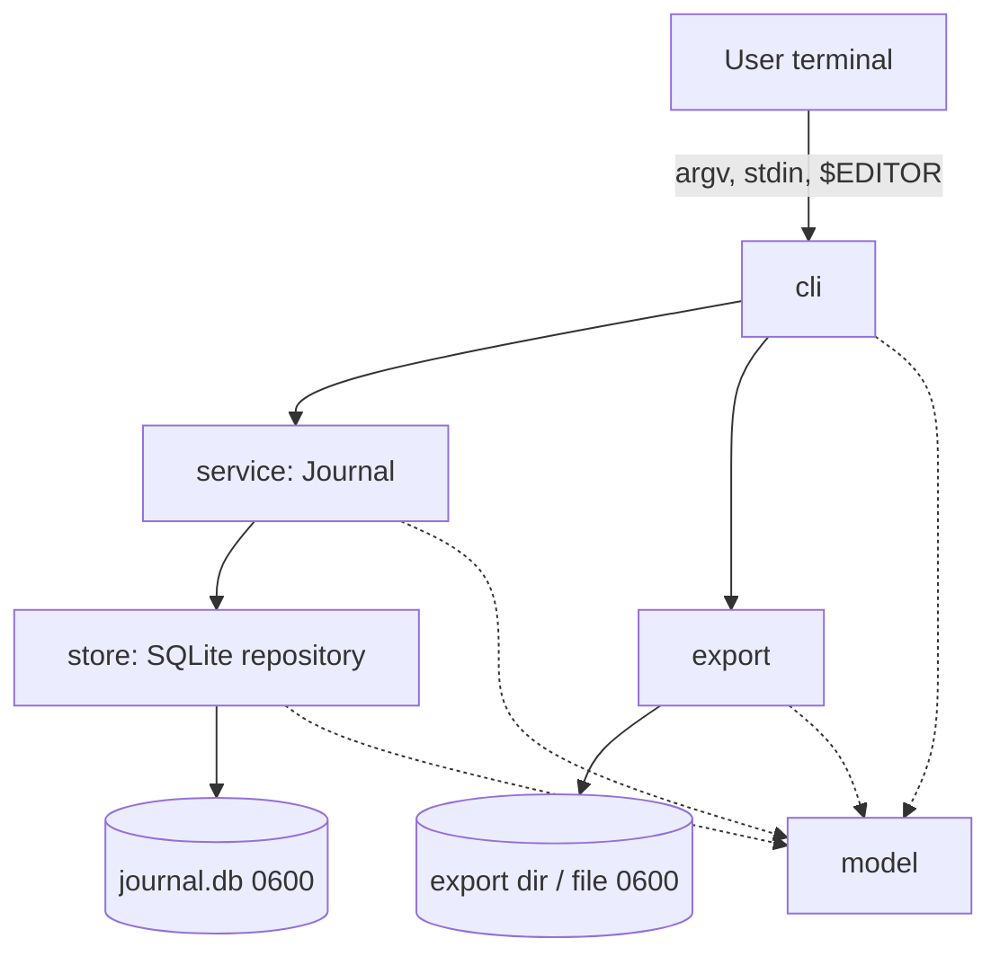

# Architecture Graph — Resonance Journal

```mermaid
graph TD
  U[User terminal] -->|argv, stdin, $EDITOR| CLI[cli]
  CLI --> SVC[service: Journal]
  CLI --> EXP[export]
  SVC --> ST[store: SQLite repository]
  ST --> DB[(journal.db 0600)]
  EXP --> FS[(export dir / file 0600)]
  SVC -.-> M[model]
  CLI -.-> M
  EXP -.-> M
  ST -.-> M
```

Dotted lines: imports types only. Only `store` reaches the DB. Only `export`
writes journal content outside the DB.
